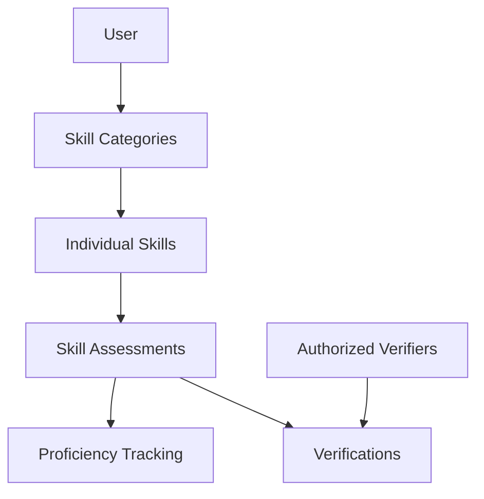

# SkillGrid Growth Tracker

A blockchain-based platform for transparent and verifiable skill development tracking built on Stacks. SkillGrid enables users to create personalized skill trees, track progress, and receive verified assessments from trusted evaluators.

## Overview

SkillGrid Growth Tracker provides a decentralized solution for:
- Creating and managing skill categories and individual skills
- Tracking skill proficiency levels (1-10 scale)
- Setting growth targets and monitoring progress
- Receiving verified assessments from authorized evaluators
- Maintaining an immutable record of skill development

The platform ensures transparency while giving users full control over their skill records and verifier relationships.

## Architecture

The system is built around a core smart contract that manages skill records, assessments, and verifications.



### Core Components:
- **Skill Categories**: Top-level organization of skills
- **Skills**: Individual competencies tracked within categories
- **Assessments**: Recorded evaluations of skill proficiency
- **Proficiency Tracking**: Current and target skill levels
- **Verifications**: Endorsements from authorized evaluators

## Contract Documentation

### Main Functions

#### Category Management
- `create-category`: Create a new skill category
- `update-category`: Modify an existing category
- `get-category`: Retrieve category details

#### Skill Management
- `create-skill`: Add a new skill to a category
- `update-skill`: Modify skill details
- `get-skill`: Retrieve skill information

#### Assessment & Tracking
- `record-assessment`: Log a new skill assessment
- `set-target-level`: Set proficiency goals
- `get-skill-proficiency`: Check current skill levels
- `calculate-skill-gap`: Analyze difference between current and target levels

#### Verification System
- `authorize-verifier`: Add trusted evaluator
- `remove-verifier`: Revoke verifier access
- `verify-assessment`: Endorse skill assessment
- `is-assessment-verified`: Check verification status

## Getting Started

### Prerequisites
- Clarinet
- Stacks wallet
- Basic understanding of Clarity smart contracts

### Installation
1. Clone the repository
2. Install dependencies using Clarinet
3. Deploy contracts to desired network

### Basic Usage

1. Create a skill category:
```clarity
(contract-call? .skill-grid create-category "Technical Skills" "Core programming abilities")
```

2. Add a skill:
```clarity
(contract-call? .skill-grid create-skill "Clarity Programming" "Smart contract development" u1)
```

3. Record an assessment:
```clarity
(contract-call? .skill-grid record-assessment u1 u7 "Completed advanced tutorial")
```

## Function Reference

### Public Functions

```clarity
(create-category (name (string-ascii 100)) (description (string-ascii 500)))
(create-skill (name (string-ascii 100)) (description (string-ascii 500)) (category-id uint))
(record-assessment (skill-id uint) (proficiency uint) (notes (string-ascii 500)))
(set-target-level (skill-id uint) (target-level uint))
(authorize-verifier (verifier principal))
(verify-assessment (owner principal) (assessment-id uint) (notes (string-ascii 500)))
```

### Read-Only Functions

```clarity
(get-category (owner principal) (category-id uint))
(get-skill (owner principal) (skill-id uint))
(get-skill-proficiency (owner principal) (skill-id uint))
(calculate-skill-gap (owner principal) (skill-id uint))
```

## Development

### Testing
Run the test suite using Clarinet:
```bash
clarinet test
```

### Local Development
1. Start Clarinet console:
```bash
clarinet console
```
2. Deploy contracts
3. Interact with contract functions

## Security Considerations

### Access Control
- Only skill owners can modify their skills and categories
- Verifications require explicit authorization
- Proficiency levels are bounded (1-10)

### Limitations
- Assessment verifications are permanent
- Skills cannot be deleted (only updated)
- Each skill can only belong to one category

### Best Practices
- Always verify transaction success
- Maintain careful control over verifier authorizations
- Regularly audit skill records and verifications